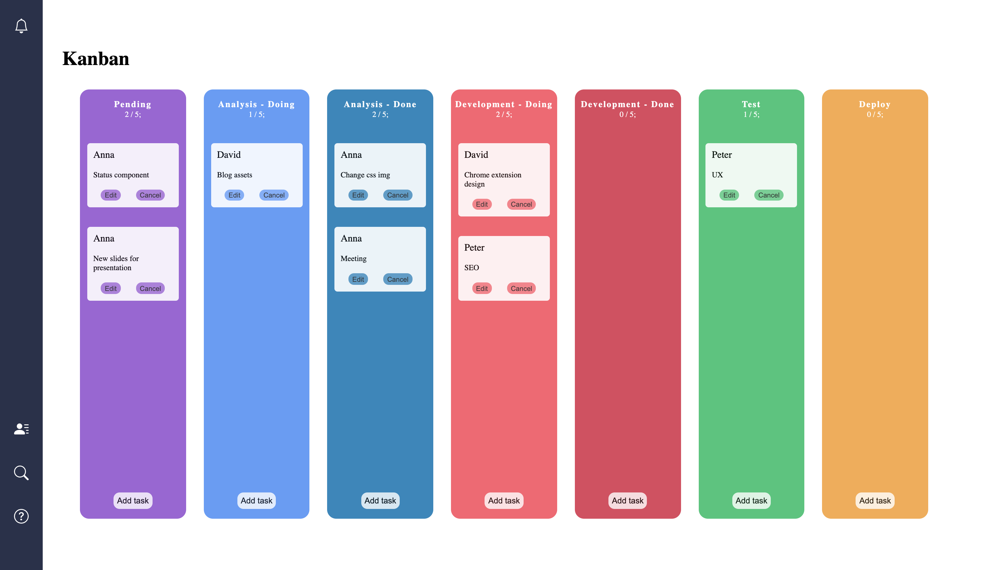

# devmentor.pl - React: Modern / Kanban App

## Table of contents

-   [Overview](#overview)
    -   [The challenge](#the-challenge)
    -   [Screenshot](#screenshot)
    -   [Links](#links)
-   [My process](#my-process)
    -   [Built with](#built-with)
    -   [What I learned](#what-i-learned)
    -   [Continued development](#continued-development)
    -   [Useful resources](#useful-resources)
-   [Author](#author)
-   [Acknowledgments](#acknowledgments)

## Overview

### The challenge

The challenge was to build an app for a potential client who required Kanban solution similar to [this one](https://kanbanblog.com/explained/). The app had to be planned accordingly to MVP pattern, which stands for <i>'minimum viable product', and refers to the initial stage of creating the first workable (and saleable) version of a new concept.</i> The technology is React with a strong accent to use React Hooks.

The user can use a Kanban board by adding, editing, and canceling tasks. Tasks are movable between the columns as well. Every column has a limit for tasks that it can contain (which is five by default). If the user reached the maximum number of tasks in a particular column it will not be possible to move another one to it or add a new one. data is saved in localStorage so the user can come back to the board as it was left before closing the web browser.

### Screenshot



### Links

-   Solution URL: [Check out my code](https://github.com/axseinga/kanbanboard-app-react)
-   Live Site URL: [and see live site here!](https://axseinga-kanbanboard-app-react.netlify.app/)

## My process

Before starting this project I have researched Kanban boards and checked different Kanban board apps. I picked [one](https://monday.com/) that I liked and decided to follow a similar design. First I coded data structure for my Kanban boards with separate tasks and columns but shortly I figure out this is not a good approach if in the future I want to make my Kanban board interactive. My Kanban board is managed by state (`columns`) created with the `useState` hook. After creating functional components (`Kanban.js`, `KanbanColumn.js`, `KanbanTask.js`) and figuring out how to correctly render tasks inside columns I decided to focus on making my Kanban board interactive and allowing the user to move tasks between columns. To achieve this goal I decided to use React Beautiful DnD library. Thanks to very good [video](https://egghead.io/courses/beautiful-and-accessible-drag-and-drop-with-react-beautiful-dnd) by Alex Reardon I learned how to use it and implemented it into my project. I had an issue with the part where the state is updated and had to come up with my version for the parts of the function that update it.

```if (start === finish) {
            const newTaskIds = Array.from(start.taskIds);

            const swapTask = newTaskIds[source.index];
            newTaskIds.splice(source.index, 1);
            newTaskIds.splice(destination.index, 0, swapTask);

            const newColumnsState = columns.map((c) => {
                if (c.id === start.id) {
                    c.taskIds = newTaskIds;
                    return c;
                } else return c;
            });

            const newColumnsState2 = [...newColumnsState];
            setColumns(newColumnsState2);
        } else {
            if (finish.taskIds.length < finish.limit) {
                const startTaskIds = Array.from(start.taskIds);
                const [item] = startTaskIds.splice(source.index, 1);

                const finishTaskIds = Array.from(finish.taskIds);
                finishTaskIds.splice(destination.index, 0, item);

                const newColumnsState = columns.map((c) => {
                    if (c.id === start.id) {
                        c.taskIds = startTaskIds;
                        return c;
                    } else if (c.id === finish.id) {
                        c.taskIds = finishTaskIds;
                        return c;
                    } else return c;
                });
```

When I finished the part with DnD library and everything was working correctly I decided to add the "add task" feature and do it using a modal window. I coded separate component for my modal and created functions to open and close it. The difficult part for me was to figure out how to know which column is clicked and to which column a new task should be added. With the advice I passed the data as a parameter of `setModal`:

```
const openModal = (data) => {
        const columnId = data.id;
        setModal(columnId);
    };
```

With that information and new content gathered from inputs, I was able to update columns appropriately and render a new view. The last bits were to create the `cancel` option to delete tasks and the `edit` option to edit tasks if needed. The `edit` option was a bit more complicated so I decided to create a separate component with the edit form.

During the process for keys, I decided to use [uuid](https://www.npmjs.com/package/uuid) which is a library to create strong, unique ids.

### Built with

-   React
-   React Hooks and custom Hooks
-   React Icons
-   Javascript
-   CSS
-   Flexbox
-   Webpack

### What I learned

With this project and learned more about React Hooks and how to create custom hooks for my applications. As well I had a chance for the first time to use the Beautiful Dnd library.

### Continued development

This Kanban board is only one view and could be a part of a much bigger application. It has the potential to add more features as comment sections for tasks, avatars related to users, deadlines, and indicating bottlenecks. And a lot more. I am planning to adjust it to the tablet and mobile versions as well.

### Useful resources

-   [Official React website](https://reactjs.org/docs/getting-started.html) - Documentation. Every question regarding React is answered.
-   [What is Kanban?](https://www.youtube.com/watch?v=iVaFVa7HYj4&list=PLaD4FvsFdarR3oF1gp5_NmnlL-BQIE9sW&index=2) - 4 shorts videos with Kanban explained by Max from Jira Software (Atlassian).
-   [10 Kanban Board Software Options You Need to Know For 2020](https://instagantt.com/gantt-chart-experts/top-10-best-kanban-board-software-in-2020) - excellent article with popular Kanban boards software. I mainly took inspiration for the design from [Monday](https://monday.com/)
-   [The Modern React Bootcamp (Hooks, Context, NextJS, Router) by Colt Steele](https://www.udemy.com/course/modern-react-bootcamp/) - very good course about React with practical exercises with Hooks.
-   [React Hooks Tutorial](https://www.youtube.com/watch?v=f687hBjwFcM) - by Ben Awad on Youtube.
-   [Official video tutorial for React Beautiful Drag'n'Drop lib](https://egghead.io/courses/beautiful-and-accessible-drag-and-drop-with-react-beautiful-dnd)
-   [React Icons](https://react-icons.github.io/react-icons) - Documentation with React Icons library.

## Author

-   Frontend Mentor - [@Axseinga](https://www.frontendmentor.io/profile/yourusername)
-   LinkedIn - [Agnieszka Urbanowicz](https://www.linkedin.com/in/agnieszka-urbanowicz-051147151/)

## Acknowledgments

Thanks to my [Mentor - devmentor.pl](https://devmentor.pl/) - for providing me with this task and for code review.
